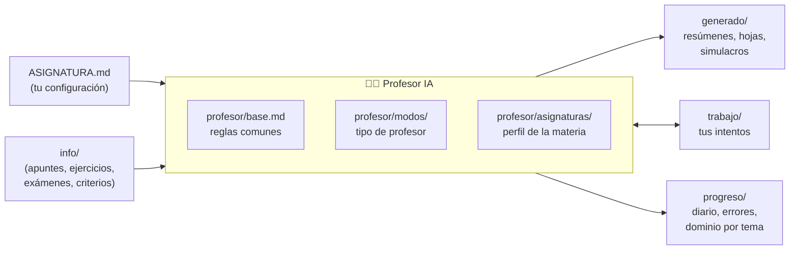

# 🎓 Profesor IA · Plantilla para Bachillerato de Ciencias y Tecnología

Plantilla para montar en pocos minutos un **profesor particular con IA** (Claude, ChatGPT u otras) para **cada asignatura** de Bachillerato.

Tú pones tus apuntes, ejercicios y exámenes en `info/`. La IA los usa para explicarte, ponerte ejercicios, corregirte y prepararte los exámenes. **No te hace los deberes**: te ayuda a ser capaz de hacerlos tú solo el día del examen.



---

## 🚀 Empieza aquí (5 pasos)

Para empezar desde GitHub, consulta [Clonar la plantilla y crear un proyecto en ChatGPT](docs/04-chatgpt.md). Incluye los comandos de descarga, la configuración inicial y cómo conservar tu progreso.

| Paso | Qué haces | Guía |
|---|---|---|
| 1 | **Crea el proyecto de tu asignatura** a partir de esta plantilla (botón *Use this template* de GitHub, script o ZIP) | [docs/01-crear-proyecto.md](docs/01-crear-proyecto.md) |
| 2 | **Mete tu material** en `info/` (apuntes, hojas de ejercicios, exámenes de otros años, criterios de corrección) | [docs/06-preparar-info.md](docs/06-preparar-info.md) |
| 3 | **Elige con qué IA** lo vas a usar | Tabla de abajo ⬇️ |
| 4 | **Configura la asignatura**: la IA te hace una pequeña entrevista y rellena `ASIGNATURA.md` | `/empezar` o pega la frase de configuración |
| 5 | **Estudia** eligiendo el tipo de profesor que necesites en cada momento | [prompts/frases-utiles.md](prompts/frases-utiles.md) |

### ¿Con qué IA?

| Opción | Lo mejor | Lo peor | Guía |
|---|---|---|---|
| **Claude Code** (terminal, app de escritorio o VS Code) | ⭐ La más completa: lee `info/` directamente, guarda tu progreso sola y tiene comandos (`/ejercicios`, `/examen`…) | Hay que instalarla | [docs/02-claude-code.md](docs/02-claude-code.md) |
| **Claude.ai → Proyectos** | Muy fácil, sin instalar nada. Las fórmulas se ven bien | Tienes que copiar a mano el progreso que te da | [docs/03-claude-web.md](docs/03-claude-web.md) |
| **ChatGPT → Proyectos** | Muy fácil, sin instalar nada | Tienes que actualizar los archivos de progreso que añadas | [docs/04-chatgpt.md](docs/04-chatgpt.md) |
| **Otras** (Gemini Gems, Codex, Copilot, Cursor…) | Funciona con cualquier IA que acepte instrucciones y archivos | — | [docs/05-otras-ias.md](docs/05-otras-ias.md) |

---

## 🧑‍🏫 Tipos de profesor (modos)

Puedes cambiar de modo cuando quieras diciendo, por ejemplo, *"modo examinador"*.

| Modo | Es como… | Úsalo para | Claude Code |
|---|---|---|---|
| [`socratico`](profesor/modos/socratico.md) | El profe que te hace pensar a base de preguntas | Entender **por qué** funciona algo | `/estudiar` |
| [`explicador`](profesor/modos/explicador.md) | Una clase particular ordenada | Aprender un tema desde cero o repasarlo entero | `/estudiar` |
| [`entrenador`](profesor/modos/entrenador.md) | Un entrenador que te pone series de ejercicios | Practicar con pistas graduadas | `/ejercicios` |
| [`examinador`](profesor/modos/examinador.md) | El día del examen | Simulacros con nota y corrección realista | `/examen` |
| [`corrector`](profesor/modos/corrector.md) | El profe con el boli rojo | Revisar lo que has hecho tú (texto, foto o archivo) | `/corregir` |
| [`repaso`](profesor/modos/repaso.md) | Tarjetas de memoria | Repaso rápido antes del examen | `/repaso` |
| [`planificador`](profesor/modos/planificador.md) | Tu agenda de estudio | Plan día a día hasta el examen | `/plan` |
| [`feynman`](profesor/modos/feynman.md) | Un compañero que no se entera | Explicarlo **tú** y descubrir tus lagunas | `/feynman` |

## 📚 Perfiles de asignatura

Cada perfil le dice a la IA cómo se enseña y se evalúa esa materia (notación, errores típicos, tipo de examen…).

| Perfil | Asignaturas |
|---|---|
| [`matematicas`](profesor/asignaturas/matematicas.md) | Matemáticas I y II |
| [`fisica`](profesor/asignaturas/fisica.md) | Física y Química (parte de Física, 1º), Física (2º) |
| [`quimica`](profesor/asignaturas/quimica.md) | Física y Química (parte de Química, 1º), Química (2º) |
| [`tecnologia-ingenieria`](profesor/asignaturas/tecnologia-ingenieria.md) | Tecnología e Ingeniería I y II |
| [`dibujo-tecnico`](profesor/asignaturas/dibujo-tecnico.md) | Dibujo Técnico I y II |
| [`biologia`](profesor/asignaturas/biologia.md) | Biología, Geología y CC. Ambientales (1º), Biología (2º) |
| [`programacion-tic`](profesor/asignaturas/programacion-tic.md) | TIC, Programación, Computación y Robótica |
| [`lengua-literatura`](profesor/asignaturas/lengua-literatura.md) | Lengua Castellana y Literatura I y II (sirve de base para lenguas cooficiales) |
| [`ingles`](profesor/asignaturas/ingles.md) | Lengua Extranjera (Inglés) I y II |
| [`historia`](profesor/asignaturas/historia.md) | Historia de España, Historia del Mundo Contemporáneo |
| [`filosofia`](profesor/asignaturas/filosofia.md) | Filosofía (1º), Historia de la Filosofía (2º) |

¿Falta la tuya? Copia [`profesor/asignaturas/_plantilla.md`](profesor/asignaturas/_plantilla.md) y rellénala (o pídele a la IA que lo haga a partir de tu temario).

---

## 🗂️ Estructura

```
├── ASIGNATURA.md          ← TU configuración (asignatura, perfil, modo, exámenes, cómo aprendes)
├── AGENTS.md / CLAUDE.md  ← Instrucciones de arranque para la IA (no hace falta tocarlos)
├── profesor/
│   ├── base.md                    ← Reglas comunes a todas las asignaturas
│   ├── configuracion-inicial.md   ← Entrevista para rellenar ASIGNATURA.md
│   ├── modos/                     ← Tipos de profesor
│   └── asignaturas/               ← Perfiles por materia
├── info/                  ← TU material: temario, apuntes, ejercicios, exámenes, criterios
│   └── INDICE.md          ← Índice que crea la IA para encontrar las cosas rápido
├── trabajo/               ← Tus intentos y resoluciones (lo tuyo)
├── generado/              ← Lo que crea la IA: resúmenes, hojas, soluciones, simulacros, tarjetas
├── progreso/              ← Diario de sesiones, errores frecuentes y semáforo de temas
├── prompts/               ← Textos para copiar y pegar en Claude.ai / ChatGPT
├── scripts/               ← Crear asignatura nueva y "compilar" las instrucciones en un solo archivo
├── ejemplos/              ← Una asignatura configurada y una sesión de ejemplo
└── docs/                  ← Guías paso a paso
```

## ✅ Uso responsable

La IA de esta plantilla está configurada para **guiarte, no para sustituirte**: da pistas antes que soluciones, no redacta trabajos que vayas a entregar y te dice cuándo no está segura. Lee [docs/07-uso-responsable.md](docs/07-uso-responsable.md) (2 minutos) — incluye qué material **no** debes subir a un repositorio público.

## 🛠️ Personalizar

Todo son archivos Markdown: puedes editar cualquier modo, perfil o regla. El orden de prioridad es:

```
Reglas innegociables de base.md  >  ASIGNATURA.md  >  modo  >  perfil de asignatura  >  resto de base.md
```

Si mejoras un perfil o creas un modo nuevo, hazlo en la **plantilla** y así lo tendrán todas tus asignaturas nuevas.
